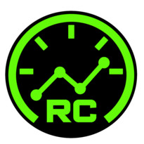
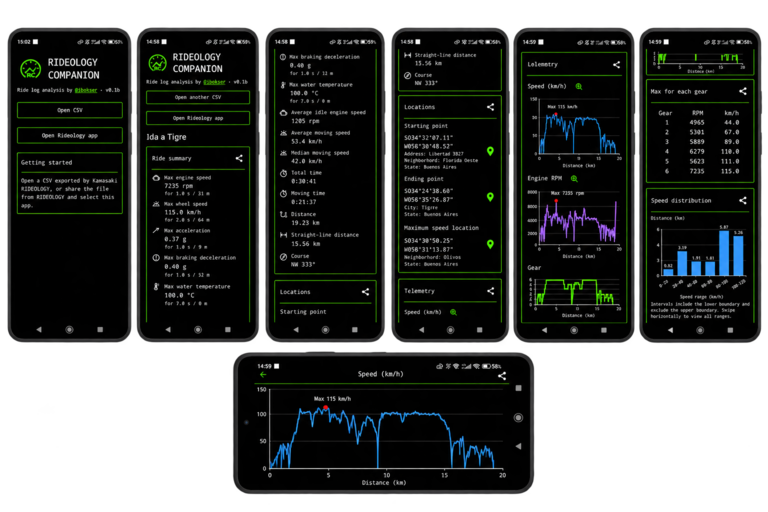
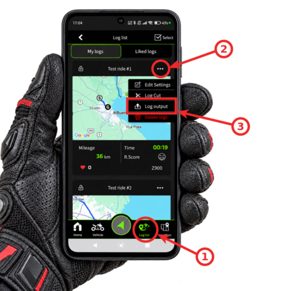

# Rideology Companion

Rideology Companion is an Android application designed to analyze log files exported by Kawasaki's RIDEOLOGY app. Its goal is to provide additional data analysis and charts beyond those available.

[RIDEOLOGY THE APP](https://www.kawasaki.eu/en/about-kawasaki/rideology.html) is Kawasaki's smartphone app for compatible motorcycles. It records riding logs that can include a GPS route and motorcycle data, depending on the model. The ride `.csv` files exported from this app are the input data for **Rideology Companion**.



## Project history and author

Author: **Juan S. Bokser** ([GitHub](https://github.com/jbokser), [email](mailto:juan.bokser@gmail.com)). This was made 100% through vibe coding with OpenAI Codex under his direction.

This development was inspired by the [rideology2gpx](https://github.com/jbokser/rideology2gpx) project.

## Export a ride from Rideology



1. Open the Rideology app and go to **Log List**.
2. Find the ride you want to export and tap the three-dot menu in its corner.
3. Select **Log Output**. Rideology exports the ride as a `.csv` file. In the Android share menu, select **Rideology Companion** to send the file directly to the app and analyze the ride. You can also save the CSV and open it later from Rideology Companion.

## Download & Install

Requires Android 7.0 or later.

1. On your Android device, open the [GitHub Releases page](https://github.com/jbokser/rideology-companion/releases) and select the version you want to install. Releases marked **Pre-release** are beta versions.
2. Expand **Assets** and download the `rideology-companion-v<version>.apk` file. The source code archives are for developers and cannot be installed as an Android app.
3. Open the downloaded APK from your browser's downloads or your file manager.
4. If Android requests permission, allow **Install unknown apps** for the browser or file manager you used, then return to the installer.
5. Tap **Install**, then **Open** to launch Rideology Companion.

To update the app, download and install the APK from a newer release in the same way.

## Useful notes for developers

### Technology Stack

- Kotlin
- Jetpack Compose and Material 3
- Gradle with Kotlin DSL
- AndroidX

The minimum supported Android version is Android 7.0 (API 24). The project uses compile SDK and target SDK 37.

### Getting Started

1. Open the repository in Android Studio.
2. Install Android SDK Platform 37 through the SDK Manager (package `platforms;android-37.0`) and Build Tools 37.0.0 (package `build-tools;37.0.0`).
3. Allow Gradle to synchronize and download the required dependencies.
4. Select an emulator or device running Android 7.0 or later and run the `app` configuration.

### Build and Test

From the repository root, with a compatible JDK and the Android SDK configured:

```bash
./gradlew :app:assembleDebug
```

The debug APK is generated at `app/build/outputs/apk/debug/app-debug.apk`.

Run local unit tests:

```bash
./gradlew :app:testDebugUnitTest
```

Run instrumented tests with a connected device or running emulator:

```bash
./gradlew :app:connectedDebugAndroidTest
```

Unit tests cover parsing, missing and invalid fields, timing gaps, stopped rides, maxima, and coordinate formatting. Instrumented tests cover CSV attachment reception, summary presentation, activity recreation, missing attachments, clipboard copying, the plain-text payload passed to the Android Sharesheet, and scrollbar touch target size, dragging, track taps, and accessibility adjustment. A synthetic CSV fixture is included only in debug builds at `app/src/debug/res/raw/sample_ride.csv`.

### GitHub Releases

The [release workflow](.github/workflows/release.yml) runs when a tag matching `v*` is pushed. It installs JDK 25 and Android SDK 37, runs local unit tests, builds the release APK, validates the tag against the generated APK metadata, then aligns, signs, and verifies the APK before creating a GitHub release with automatically generated notes and the signed APK attached. Signing is performed by the workflow; local `assembleRelease` builds remain unsigned.

The tag must be exactly `v` followed by `versionName` from `app/build.gradle.kts`. Numeric versions such as `0.2.0` create normal releases. Versions ending in `b`, `b` plus a number, `-beta`, or `-beta.` plus a number create prereleases, for example `v0.1b` or `v0.2.0-beta.1`. Other suffixes are rejected rather than published as stable releases. Prereleases are not marked as the latest release.

Configure these repository secrets under **Settings → Secrets and variables → Actions** before pushing a release tag:

| Secret | Value |
| --- | --- |
| `ANDROID_KEYSTORE_BASE64` | Base64-encoded release keystore file. |
| `ANDROID_KEYSTORE_PASSWORD` | Keystore password. |
| `ANDROID_KEY_ALIAS` | Alias of the release signing key. |
| `ANDROID_KEY_PASSWORD` | Password of that key; use the keystore password if they are the same. |

Use an existing release signing key if the app has already been distributed. Otherwise create a key once with Android Studio's **Generate Signed Bundle / APK** wizard and keep a secure backup. Future APK updates must use the same signing key. Never commit the keystore or passwords. To encode the keystore on Linux, run `base64 -w 0 /path/to/release.jks` and store the output directly in the secret. The workflow uses GitHub's automatic `GITHUB_TOKEN`; no personal access token is required. Repository or organization policies must allow the workflow's `contents: write` permission to create releases.

For each release:

1. Update `versionName` and increment `versionCode` in `app/build.gradle.kts`.
2. Commit and push the changes, including the workflow for the first release.
3. Create and push the matching tag, for example:

```bash
git tag -a v0.2.0-beta.1 -m "Release v0.2.0-beta.1"
git push origin v0.2.0-beta.1
```

The example assumes `versionName = "0.2.0-beta.1"`. Track the run in GitHub's **Actions** tab and download `rideology-companion-v0.2.0-beta.1.apk` from **Releases** after success. A missing secret, mismatched tag, failing test, or invalid signature prevents publication. Existing releases are not overwritten; reruns cannot replace a published release. Instrumented tests still require a device or emulator and are not run by this workflow.

Run the release metadata checks locally with `python3 -m unittest discover -s scripts -p 'test_*.py'`.

### Project Structure

- `app/src/main/java/com/jbokser/rideology_companion/MainActivity.kt`: application entry point and current screen.
- `app/src/main/java/com/jbokser/rideology_companion/data/`: CSV parsing, ride data models, and analysis.
- `app/src/main/java/com/jbokser/rideology_companion/ui/theme/`: Compose theme definitions.
- `app/src/main/res/`: Android resources.
- `app/src/test/`: local unit tests.
- `app/src/androidTest/`: instrumented tests.
- `gradle/libs.versions.toml`: dependency and plugin versions.

### Development Guidelines

See [AGENTS.md](AGENTS.md) for project development guidelines. All project documentation and code comments must be written in neutral, professional English.
